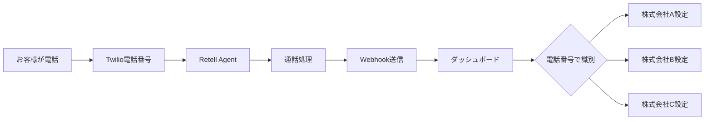

# Retell AIエージェント管理ガイド

## 概要
1つのRetell AIアカウントで複数のお客様向けエージェントを管理する方法です。

## システム構成

```
御社のRetell AIアカウント (1つ)
│
├── APIキー: key_424284122e45372cf604e251018c (共通)
│
├── エージェント管理
│   ├── Agent A (株式会社A用)
│   │   ├── 電話番号: +81-50-1234-5678
│   │   ├── Agent ID: agent_xxxxx_a
│   │   └── 応答設定: 株式会社A用カスタマイズ
│   │
│   ├── Agent B (株式会社B用)
│   │   ├── 電話番号: +81-50-1234-5679
│   │   ├── Agent ID: agent_xxxxx_b
│   │   └── 応答設定: 株式会社B用カスタマイズ
│   │
│   └── Agent C (株式会社C用)
│       ├── 電話番号: +81-50-1234-5680
│       ├── Agent ID: agent_xxxxx_c
│       └── 応答設定: 株式会社C用カスタマイズ
│
└── 共通Webhook
    └── https://retell-dashboard-opal.vercel.app/api/webhook/retell
```

## 新規お客様の追加手順

### 1. Retell Dashboardでエージェント作成

1. [Retell Dashboard](https://dashboard.retellai.com)にログイン
2. 「Agents」→「Create Agent」
3. 基本設定:
   ```
   Agent Name: Company A Reception
   Language: Japanese
   Voice: 11labs-Adrian (またはお好みの音声)
   ```

4. 応答設定をカスタマイズ:
   ```
   Opening Message: お電話ありがとうございます。株式会社Aでございます。
   System Prompt: あなたは株式会社Aの受付担当です...
   ```

5. エージェントIDをメモ（例: `agent_abc123def456`）

### 2. Twilioで電話番号取得

1. [Twilio Console](https://console.twilio.com)にログイン
2. 電話番号を購入（日本の050番号など）
3. Retellと連携設定

### 3. RetellとTwilioの連携

1. Retell Dashboardで「Phone Numbers」
2. 「Import Twilio Number」
3. 取得した電話番号を選択
4. エージェントと紐付け

### 4. ダッシュボードの環境変数更新

`.env.local`または Vercel環境変数に追加:

```bash
TENANT_PHONE_MAPPING='[
  {
    "phone": "+815012345678",
    "tenantId": "company-a",
    "name": "株式会社A",
    "agentId": "agent_abc123def456",
    "color": "#FF6B6B",
    "lineUserId": "Uxxxxx_a",
    "features": {
      "line": true,
      "gpt": true,
      "recording": true
    }
  }
  # 既存のお客様設定...
]'
```

## 通話フローの識別



### 識別ロジック

1. **Webhookで電話番号取得**
   ```json
   {
     "call_id": "call_xxxxx",
     "to_phone_number": "+815012345678",
     "agent_id": "agent_abc123def456"
   }
   ```

2. **電話番号からテナント特定**
   ```typescript
   const tenant = getTenantByPhoneNumber("+815012345678");
   // → 株式会社Aの設定を取得
   ```

3. **テナント別処理**
   - LINE通知: 株式会社AのLINEユーザーIDへ送信
   - 表示色: #FF6B6B（赤）
   - 機能制限: GPT分析ON、LINE通知ON

## 料金体系の考え方

### Retell AI料金
- **基本料金**: $0/月（Pay as you go）
- **通話料金**: $0.10/分
- **全お客様の通話を合算して請求**

### 電話番号料金（Twilio）
- **電話番号**: 約$1.50/月 × お客様数
- **通話料金**: 受信 約$0.0085/分

### お客様への請求例
```
基本料金: 5,000円/月
通話料金: 100円/分（Retell + Twilioコスト + マージン）
```

## エージェント設定のベストプラクティス

### 1. 命名規則
```
Agent Name: [会社名] Reception AI
例: Company A Reception AI
```

### 2. 音声設定
- **日本語対応音声を選択**
- お客様の要望に応じてカスタマイズ
- 男性/女性音声の選択

### 3. 応答カスタマイズ
```javascript
// お客様ごとの応答設定例
const agentSettings = {
  "company-a": {
    greeting: "お電話ありがとうございます。株式会社Aでございます。",
    hold_message: "少々お待ちください。",
    end_message: "ご利用ありがとうございました。"
  },
  "company-b": {
    greeting: "株式会社Bです。ご用件をお聞かせください。",
    hold_message: "確認いたしますので、少々お待ちください。",
    end_message: "お電話ありがとうございました。"
  }
};
```

## トラブルシューティング

### エージェントが応答しない
1. Twilio電話番号の設定確認
2. Retellでのエージェント紐付け確認
3. エージェントのステータス確認（Active?）

### 電話番号で識別できない
1. 環境変数の`TENANT_PHONE_MAPPING`確認
2. 電話番号の形式確認（+81形式）
3. 正規化処理の確認

### Webhook が届かない
1. Webhook URL設定確認
2. Vercelデプロイ状況確認
3. ログでエラー確認

## 管理用コマンド（開発中）

```bash
# エージェント一覧表示
npm run agents:list

# エージェント状態確認
npm run agents:status

# 電話番号マッピング確認
npm run tenants:mapping
```

## セキュリティ考慮事項

1. **APIキーの管理**
   - Retell APIキーは環境変数で管理
   - Gitにコミットしない

2. **電話番号の保護**
   - 本番環境では暗号化を検討
   - アクセス制限の実装

3. **テナント間の分離**
   - 通話データの分離
   - LINE通知の分離

## 今後の拡張案

1. **管理UI追加**
   - エージェント一覧画面
   - 電話番号マッピング編集画面
   - 通話統計ダッシュボード

2. **自動化**
   - エージェント作成API
   - 電話番号自動割り当て

3. **分析機能**
   - エージェント別パフォーマンス
   - お客様別利用統計